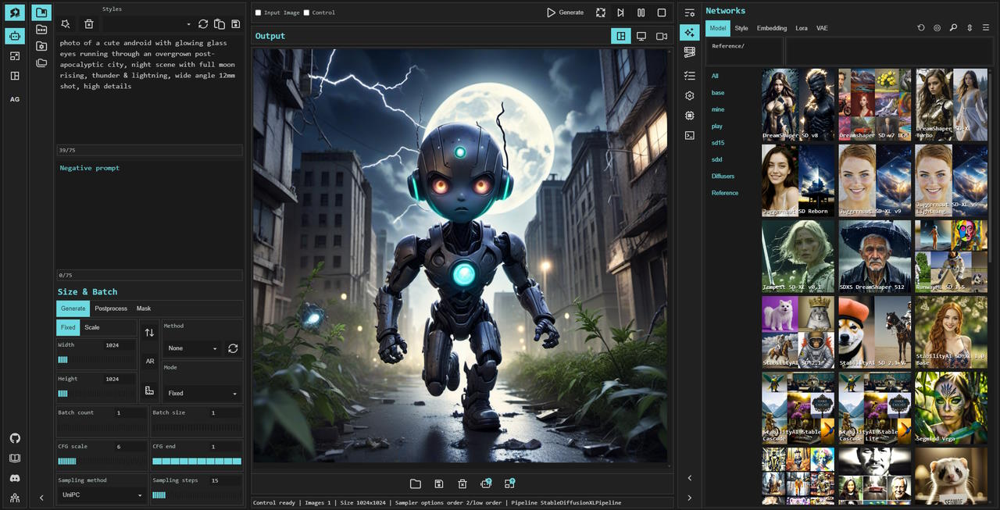

# TODO

Main ToDo list can be found at [GitHub projects](https://github.com/users/vladmandic/projects)

## Pending

Requires `diffusers-0.28.0.dev0`:
- PixArt-Σ
- IP adapter masking
- InstantStyle
- Sampler timesteps

## Dev Release Notes

New [SD.Next](https://github.com/vladmandic/automatic) release has been baking in `dev` for a longer than usual, but changes are massive - over 280 commits...

Starting with the new UI - yup, this version ships with a *preview* of the new [ModernUI](https://github.com/BinaryQuantumSoul/sdnext-modernui)  
For details on how to enable and use it, see [Home](https://github.com/BinaryQuantumSoul/sdnext-modernui) and [WiKi](https://github.com/vladmandic/automatic/wiki/Themes)  
**ModernUI** is still in early development and not all features are available yet, please report [issues and feedback](https://github.com/BinaryQuantumSoul/sdnext-modernui/issues)  
Thanks to @BinaryQuantumSoul for his hard work on this project!  

*What else?*

### New built-in features

- **Gallery**: extremely fast built-in gallery viewer  
  List, preview, search through all your images and videos!  
- **HiDiffusion** allows generating very-high resolution images out-of-the-box using standard models  
- **Perturbed-Attention Guidance** (PAG) enhances sample quality in addition to standard CFG scale  
- **IP adapter masking** allows to use multiple input images for each segment of the input image  
- IP adapter **InstantStyle** implementation  
- **Token Downsampling** (ToDO) provides significant speedups with minimal-to-none quality loss  
- **Samplers optimizations** that allow normal samplers to complete work in 1/3 of the steps!  
  Yup, even popular DPM++2M can now run in 10 steps with quality equaling 30 steps  
- Native **wildcards** support  
- Improved built-in **Face HiRes**  
- Better **outpainting**  
- And much more...  
  For details of above features and full list, see [Changelog](https://github.com/vladmandic/automatic/blob/dev/CHANGELOG.md)

### New models

While still waiting for *Stable Diffusion 3.0*, there have been some significant models released in the meantime:
- [PixArt-Σ](https://pixart-alpha.github.io/PixArt-sigma-project/), high end diffusion transformer model (DiT) capable of directly generating images at 4K resolution  
- [SDXS](https://github.com/IDKiro/sdxs), extremely fast 1-step generation consistency model  
- [Hyper-SD](https://huggingface.co/ByteDance/Hyper-SD), 1-step, 2-step, 4-step and 8-step optimized models  

*Note*  
[SD.Next](https://github.com/vladmandic/automatic) is no longer marked as a fork of [A1111](https://github.com/AUTOMATIC1111/stable-diffusion-webui/) and github project has been fully detached  
Given huge number of changes with *+3443/-3342* commits diff (at the time of fork detach) over the past year,  
a completely different backend/engine and a change of focus, it is time to give credit to original [author](https://github.com/auTOMATIC1111),  and move on!  

And best place to post questions is on our [Discord](https://discord.gg/VjvR2tabEX) server which now has over 2k active members!

For more details see: [Changelog](https://github.com/vladmandic/automatic/blob/dev/CHANGELOG.md) | [ReadMe](https://github.com/vladmandic/automatic) | [Wiki](https://github.com/vladmandic/automatic/wiki) | [Discord](https://discord.gg/VjvR2tabEX)

## Future Candidates

- stable diffusion 3.0: unreleased
- boxdiff <https://github.com/huggingface/diffusers/pull/7947>
- animatediff-sdxl <https://github.com/huggingface/diffusers/pull/6721>
- async lowvram: <https://github.com/AUTOMATIC1111/stable-diffusion-webui/pull/14855>
- fp8: <https://github.com/AUTOMATIC1111/stable-diffusion-webui/pull/14031>
- profiling: <https://github.com/lllyasviel/stable-diffusion-webui-forge/discussions/716>
- init latents: variations, img2img
- diffusers public callbacks  
- include reference styles
- lora: sc lora, dora, etc

### Missing

- control api scripts compatibility
